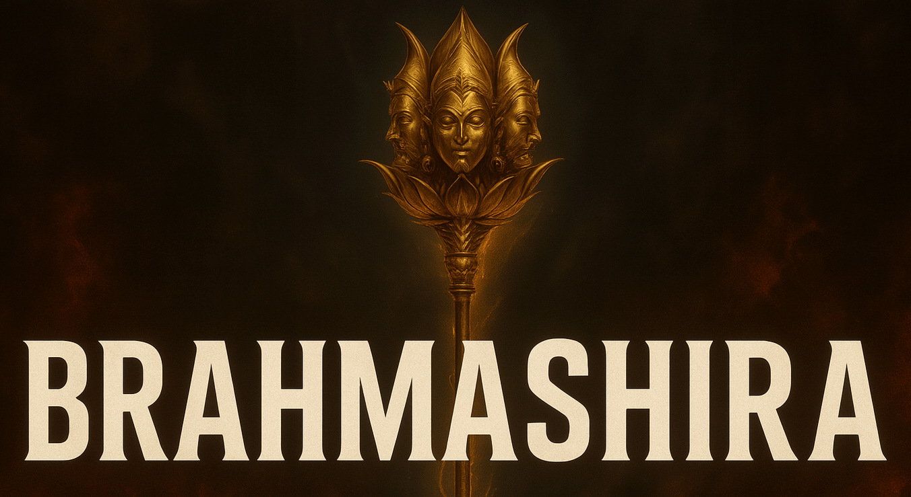

# Odoo Hackathon

## Team Brahmashira

---

## Problem Statement: StackIt – A Minimal Q&A Forum Platform

StackIt aims to solve the need for a minimal, structured, and collaborative Q&A platform that promotes knowledge sharing, community learning, and user engagement. Users often struggle to find lightweight and focused solutions that support asking questions, rich text formatting, tagging, upvoting, and notifications — all within a clean and distraction-free interface. This project addresses that gap by creating an intuitive platform for structured discussions, streamlined moderation, and personalized user interactions.

### Feature List

1. **Ask a Question**
   - Title: Short and descriptive input
   - Description: Rich text editor (bold, italic, strikethrough, lists, hyperlinks, emoji, image upload, alignment)
   - Tags: Multi-select input for relevant technologies or categories
2. **Answering System**
   - Users can answer any public question
   - Rich text formatting supported
   - Answers displayed in voted order
   - Only logged-in users can post answers
3. **Voting & Answer Acceptance**
   - Upvote/downvote answers
   - Only the question author can mark an answer as “Accepted”
   - Accepted answers are visually highlighted
4. **Tag Management**
   - Questions must include at least one relevant tag
   - Tags help with filtering and searching
   - Popular tags appear as suggestions
5. **User Roles & Permissions**
   - Guest: View all questions and answers
   - User: Register, log in, post questions/answers, vote
   - Admin: Moderate content, manage users, send platform-wide messages
6. **Moderation & Admin Features**
   - Admin can reject spam/inappropriate content
   - Admin can ban users
   - View/manage flagged content
   - Download platform reports
   - Send broadcast messages
7. **Notification System**
   - Notification bell with badge counter
   - Triggered on answers, comments, mentions
   - Dropdown view of recent notifications
8. **Dashboard**
   - User Dashboard: View posted questions, answers, upvotes
   - Admin Dashboard: Monitor activity logs, top contributors, moderation queue
9. **Search & Filters**
   - Search by title, description, or tags
   - Filters: Unanswered, most voted, recent activity

---

## Team Members

- **Pankaj Gupta** – pankajgupta0695@gmail.com
- **Sahil Tanwani** – sahiltanwani24@gmail.com
- **Priyanka Ochaney** – priyanka.ochaney@gmail.com
- **Harshita Sewani** – harshitasewani005@gmail.com

---

Welcome to the Odoo Hackathon project by Team Brahmashira!

This project is part of an innovative hackathon event focused on leveraging the power of Odoo, an open-source suite of business applications. Our goal is to build creative, scalable, and impactful solutions that address real-world business challenges using Odoo's modular platform.

Stay tuned for updates as we build and refine our solution!
